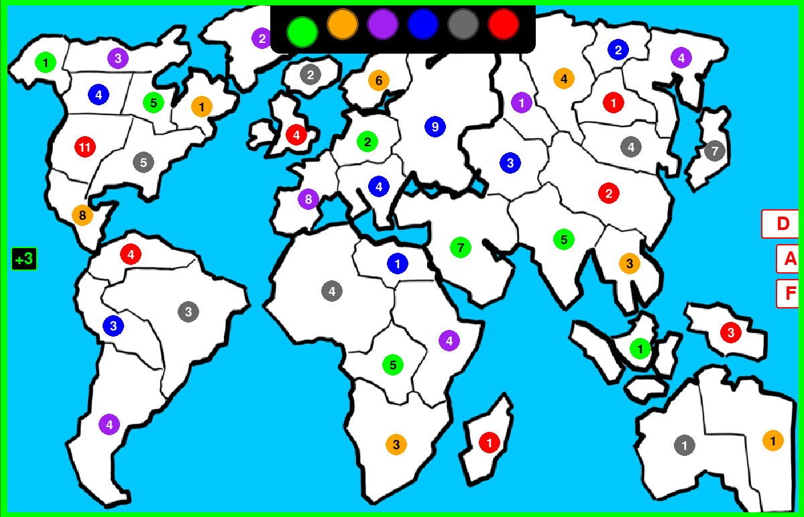

`pyRISK` is a recreation of the popular board game RISK in python.

# Installation

1. Install the `pygame` library using `pip`
    + `$ pip install pygame`

2. Clone the git repository to your local directory using
    + https: `$ git clone https://github.com/IMaxiM03I/pyRISK.git`
    + ssh: `$ git clone git@github.com:IMaxiM03I/pyRISK.git`

# Usage

- Starting the game
    - Run `main_pg.py` to start the game.
    - The user will be asked to set up the board by choosing:
        1. The number of players that will be playing
        2. The color of each player's army
    - Any and all steps in the board setup phase can be skipped by pressing `ENTER`.
    - Once the board setup is complete, a new window will open where the game can be played.

- Game Rules
    - The game rules are based on HASBRO's own [ruleset](https://www.hasbro.com/common/instruct/risk.pdf), under the `classic WORLD DOMINATION` section.
    - Phases will advance automatically if no more options are available.
    - Players will switch turns automatically if no fortifications can be conducted.